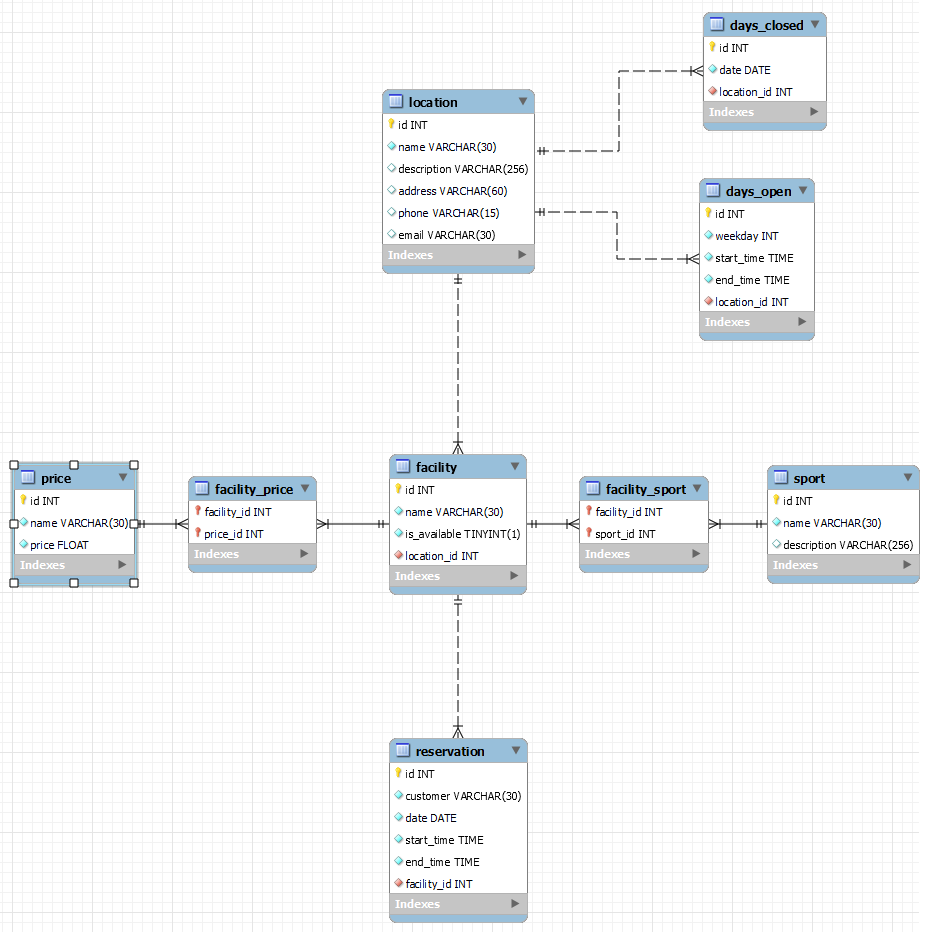

# Database layout

## Description
For this project we chose SQLAlchemy 2.0 for our database communication.
SQLAlchemy's ORM simplifies database interactions with Python objects. 
Its support for multiple database backends ensures flexibility. 
Advanced querying capabilities allow concise and readable code.

## Database Layout
The database consists of the following tables:

### Location
- represents the physical location of multiple sportfacilities

### Facility
- represents a sport-field or individual facility that people can book for sports

### Sport
- list of available sports

### Price
- list of available prices

### DaysOpen
- list of weekdays a location is open 

### DaysClosed
- list of calendar days a location is closed

### Reservation
- represents a reservation of a facility
